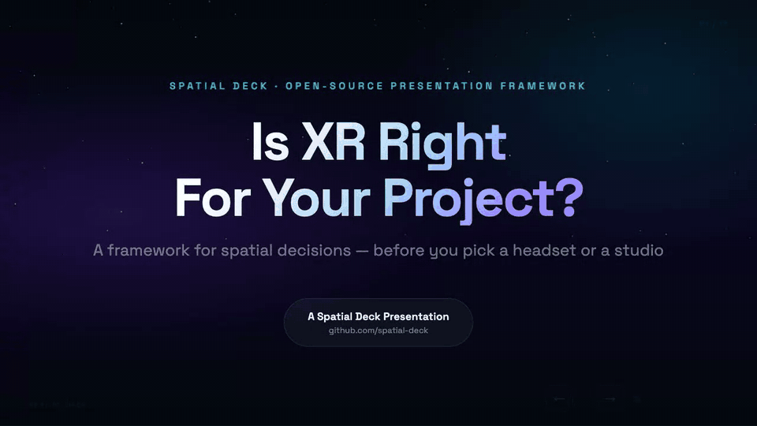

# 🎭 Spatial Deck

**The presentation framework for people who think spatially.**

One HTML file that runs anywhere, forever — no cloud, no build process, no lock-in. A deck an AI can edit with you right up until showtime. Presenter tooling PowerPoint never gave you. Draft your content wherever it's easiest, make it spectacular here, then hand back a pixel-faithful PDF when someone asks for "the deck."

> *Designed at [Agile Lens](https://agilelens.com) — a 10-year-old immersive design studio that has given talks at Harvard, SIGGRAPH, the Kennedy Center, and everywhere in between.*



---

## 📖 Origin Story

In April 2026, [Alex Coulombe](https://twitter.com/ibrews) was asked to give the closing keynote at the [Harvard XR Conference](https://harvardxr.com). The talk — *"10 Lessons from 10 Years"* — needed to cover a decade of building XR experiences at Agile Lens.

PowerPoint wasn't going to cut it.

Alex needed a presentation system that could handle animated pixel-art avatars, canvas-based media galleries with pixelated reveal effects, Web Audio sound design, an interactive constellation map, live annotation and repositioning of any element, and — critically — the ability to iterate on slides *with an AI collaborator* right up until showtime. All in a single HTML file that could run from a USB stick at a Harvard podium.

So he built one. With Claude.

The Harvard keynote was a hit. The framework that powered it became **Spatial Deck** — extracted, generalized, and open-sourced so anyone can build presentations that feel as alive as the work they're presenting.

**[See the original Harvard keynote →](https://ibrews.github.io/harvardxr-keynote/)**

---

## ✨ What Makes This Different

| Feature | PowerPoint | Google Slides | Claude Design | Spatial Deck |
|---------|-----------|--------------|--------------|-------------|
| Single file, no cloud | ❌ | ❌ | ❌ (hosted) | ✅ |
| Live annotation mode | ❌ | ❌ | ❌ | ✅ |
| Drag-to-reposition anything | ❌ | ✅ | ❌ | ✅ |
| Undo/redo in layout mode | ✅ | ✅ | ✅ | ✅ |
| Media cycler with pixelated reveal | ❌ | ❌ | ❌ | ✅ |
| Animated constellation map | ❌ | ❌ | ❌ | ✅ |
| Web Audio sound effects | ❌ | ❌ | ❌ | ✅ |
| Full theme editor (live) | Limited | Limited | ✅ | ✅ |
| Speaker notes + timing estimator | ✅ | ✅ | ❌ | ✅ |
| Pacing indicator (presenter popup) | ❌ | ❌ | ❌ | ✅ |
| Multi-step slide animations | Limited | Limited | Limited | ✅ |
| Vertical scroll mode (long-form) | ❌ | ❌ | ❌ | ✅ |
| Works offline from a USB stick | ❌ | ❌ | ❌ | ✅ |
| AI-friendly (LLM can edit it) | ❌ | ❌ | ✅ | ✅ |
| Version control with Git | ❌ | ❌ | ❌ | ✅ |
| Runs on any device with a browser | ❌ | ✅ | ✅ | ✅ |

> **Claude Design vs. Spatial Deck:** Anthropic's [Claude Design](https://claude.ai/design) (launched April 2026) and Spatial Deck converge from opposite ends — Claude Design brings AI-native visuals to non-developers; Spatial Deck gives developers the depth layer beneath: speaker notes, move mode, pacing indicator, annotation export, and offline-safe presenting. Claude Design's "code handoff to Claude Code" feature points naturally to Spatial Deck as the runtime for that handoff.

---

## 🚀 Quick Start

```bash
# Clone it
git clone https://github.com/ibrews/spatial-deck.git
cd spatial-deck

# Open it
open index.html
# That's it. No npm install. No webpack. No tears.
```

---

## 🔁 The Full Loop

Draft dumb, make it amazing, ship it back out — every leg is tooled:

1. **Draft anywhere** — Google Slides, PowerPoint, Markdown, a PDF, rough notes. Whatever's lowest-friction.
2. **Pull it in** — `tools/sync_gslides.py pull` keeps a living Google Slides draft synced (diff-aware, per-slide state); `import_pptx.py` / `import_md.py` / `import_pdf.py` / `import_html.py` handle one-shots.
3. **Make it amazing** — move mode, keyframe animations, media cyclers, live themes, Web Audio, the constellation map.
4. **Share it live** — a GitHub Pages link, a `?vertical` scroll doc, or offline from a USB stick.
5. **Hand back the file they asked for** — `tools/export_pdf.py` renders a pixel-faithful PDF *using the deck itself as the renderer*; `tools/export_pptx.py --visual` does the same for PowerPoint. Every exporter prints a fidelity report, so anything that degraded (a cycler frozen to its first frame, an iframe to a URL panel) is informed loss, never silent loss.

---

## 📚 Full Documentation

**[→ docs/wiki/](docs/wiki/index.md)** — comprehensive wiki covering content authoring, media, move mode, themes, presenter tools, animations, import/export tools, AI workflow, keyboard shortcuts, and troubleshooting.

---

## Things to Try

1. **Open `index.html` in any browser** — the cover slide loads instantly with no build step; press `→` or `Space` to advance through the sample presentation.
2. **Press `M` to enter Move Mode, then drag the title on any slide** — a position like `left:45%, top:32%` auto-copies to your clipboard so you can pass exact coordinates to an AI collaborator.
3. **Press `A` to enter Annotation Mode and click anywhere on a slide** — a note panel appears; click Export to get all annotations as copyable markdown for AI handoff.
4. **Open slide 0 (Settings, accessible via the slide grid) and change the font family or accent color** — the entire deck re-themes live without a reload; settings persist across browser restarts.
5. **Press `N` to open the Presenter Popup, then navigate a few slides** — a second window tracks speaker notes, elapsed time, next-slide preview, and a pacing indicator (green / yellow / red).
6. **Append `?vertical` to the URL (or toggle "Vertical Scroll Mode" in Settings)** — slides flip from step-through presentation to a long-form scrollable page; great for sharing a deck as a readable web doc. Toggle off (or remove `?vertical`) to return to presentation mode.
7. **Run `python3 tools/export_pdf.py`** — every visible slide captured pixel-faithfully into a 16:9 PDF, rendered by the deck itself (needs Google Chrome installed), ending with a fidelity report of anything that degraded.

---

## 🎯 How It Works

### The SECTIONS Array

Everything in your presentation is driven by a single JavaScript array at the top of `index.html`:

```javascript
const SECTIONS = [
  {
    year: 2024, accent: 'teal',
    lesson: {
      title: 'Your Lesson Title\nWith Line Breaks',
      tagline: 'The body text that explains the lesson...',
      short: 'SHORT TAG',
      tags: 'Tag One · Tag Two · Tag Three',
      notes: 'Speaker notes: what to say when this slide is up'
    },
    cases: [
      {
        title: 'Case Study Title',
        subtitle: 'One-line description',
        img: 'MEDIA_CYCLER',  // or 'path/to/image.jpg' or 'IFRAME:url' or ''
        bullets: ['Point one', 'Point two', 'Point three'],
        notes: 'Talking points for this case study'
      },
    ]
  },
  // ... more sections
];
```

Change the data → the slides update. That's the whole mental model.

### Lesson Slides

Each section generates a lesson slide with the year, lesson number, title, and tagline:


### Case Study Slides

Case studies show an image/media area alongside the title, subtitle, and bullet points:


### Slide Types

| Type | Created From | Purpose |
|------|-------------|---------|
| `cover` | Hardcoded | Title slide |
| `lesson` | `SECTIONS[].lesson` | Year + lesson title + tagline |
| `case` | `SECTIONS[].cases[]` | Image/media + title + bullets |
| `bonus` | `BONUS` const | Special amber-accent closer |
| `map` | Auto-generated | Animated constellation of all lessons |
| `close` | Hardcoded | QR codes + contact info |
| `settings` | Auto-generated | Hidden slide 0 with live controls |

### Case Study Layout Types

Set `layout:` on a case study entry:

| Layout | Description |
|--------|------------|
| *(default)* | 48% media left, 52% content right |
| `placed` | Full-bleed slide with absolutely positioned images/videos at `left:X%, top:Y%, w:Z%, h:W%` |
| `big` | Full-screen typographic statement with `bigText` field |

**`placed` example:**
```javascript
{ layout: 'placed', title: 'Optional overlay',
  placedImages: [
    ['media/bg.jpg', 0, 0, 100, 100],       // [src, left%, top%, w%, h%]
    ['media/clip.mp4', 50, 20, 45, 60],     // .mp4 → <video muted loop autoplay>
  ] }
```

**`big` example:**
```javascript
{ layout: 'big', bigText: 'The constraint\nis the design.',
  title: 'Optional eyebrow', bigCaption: 'Optional small caption below' }
```

---

## 🎮 Keyboard Shortcuts

### Presentation Mode
| Key | Action |
|-----|--------|
| `→` `Space` `PageDown` | Next slide |
| `←` `PageUp` | Previous slide |
| `Home` | First slide |
| `End` | Last slide |
| `H` | Toggle UI chrome (presentation mode) |
| `G` | Toggle layout grid (in move mode) |
| `Cmd/Ctrl + F` or `/` | Search all slide text |
| `N` | Open presenter popup (speaker notes) |
| `Shift + N` | Toggle inline notes drawer |
| `Shift + P` | Split presenter view (deck top 58%, notes pinned bottom 42%) |
| `👁` button (mobile) | Toggle UI chrome on touch devices |

### URL Sharing Modes

| URL | Mode |
|-----|------|
| `yoursite.com/` | View mode (default) — clean, no edit chrome |
| `yoursite.com/?edit` | Edit mode — all chrome visible, even on mobile |
| `yoursite.com/?view` | Explicit view mode (same as default) |
| `yoursite.com/?landscape` | Shows "rotate to landscape" prompt on portrait phones |
| `yoursite.com/?vertical` | Vertical scroll mode — slides flow down the page (long-form / web-doc reading) |
| `yoursite.com/?edit` | Edit mode — lands on Settings slide (slide 0) so you can configure first |
| `yoursite.com/?edit#15` | Edit mode, starting at slide 15 |
| `yoursite.com/?notes` | Phone speaker companion — notes-only view for your phone |
| `yoursite.com/?print` | Print mode — all slides as static 16:9 pages (File → Print works; `tools/export_pdf.py` drives it headlessly) |
| `yoursite.com/?shot=5` | Shot mode — slide 5 alone, full-viewport, chrome hidden (per-slide screenshot capture) |

### Mobile Support

- **Auto-detect**: phones/tablets auto-enter presentation mode (clean view)
- **Tap**: quick tap anywhere advances steps or slides
- **Swipe left/right**: navigate forward/backward (respects steps + hidden slides)
- **👁 button**: top-right toggle to show/hide UI chrome

### Move Mode (`M` to toggle)


*Move mode shows a HUD with modifier hints. Drag any element to reposition it. Transforms are auto-saved as annotations (type: 'move'). The animation scrubber at the bottom lets you replay slide animations and set keyframe animations.*

| Key/Action | Effect |
|------------|--------|
| `Drag` | Translate element |
| `Shift + Drag` | Scale element |
| `Alt/Option + Drag` | Rotate element |
| `Cmd/Ctrl + Click` | Select parent element |
| `G` | Toggle layout grid (4×3 zone overlay, A1–C4) |
| `▲▲` button | Send selected element to front |
| `▲` button | Send selected element forward |
| `▼` button | Send selected element backward |
| `▼▼` button | Send selected element to back |
| `Cmd/Ctrl + Z` | Undo |
| `Cmd/Ctrl + Shift + Z` | Redo |
| `Double-click` | Edit text inline |

### Keyframe Animation (in Move Mode)

The scrubber timeline supports keyframe-based animation via the Web Animations API (WAAPI):

| Action | Effect |
|--------|--------|
| `◆ KF` button | Capture last-moved element's transform at current scrub time |
| Diamond markers (◆) on timeline | Show existing keyframes — click to seek |
| `✕ KF` button | Delete the keyframe at current scrub time |

Two or more keyframes on the same element build a WAAPI animation automatically. Keyframes are persisted as annotations (`type: 'keyframe'`).

### Text Editing (double-click in Move Mode)
| Key | Effect |
|-----|--------|
| `Enter` | New bullet (when editing a `<li>`) |
| `Shift + Enter` | Line break within element |
| `Backspace` on empty bullet | Delete bullet |
| `Cmd/Ctrl + Enter` | Save and exit edit mode |
| `Escape` | Cancel edit |

### Annotation Mode (`A` to toggle)


*Click any element to leave a note. Click the slide background to mark a position (coordinates exported as `left:X%, top:Y%`). The annotation panel tracks all notes. Export as markdown for handoff to collaborators or AI.*

| Action | Effect |
|--------|--------|
| Click any element | Add a note |
| Export button | Copy all annotations as markdown |

### Media Cycler (on slides with image/video galleries)
| Key | Effect |
|-----|--------|
| `Shift + →` | Next image/video |
| `Shift + ←` | Previous image/video |
| `Shift + ↑` | Resume auto-advance |

---

## 🎨 Theme Editor

The Settings slide (hidden slide 0, accessible via the slide grid) includes a full live theme editor:


- **Primary & Secondary Colors** — hex color pickers that update accent colors throughout
- **Background Darkness** — adjust the base background
- **Font Family** — choose from Space Grotesk, Inter, Outfit, JetBrains Mono, Playfair Display, or enter any Google Font name
- **Title Scale** — adjust title font sizes (60%–130%)
- **Tagline Scale** — adjust body text sizes (60%–150%)
- **Paragraph Gap** — control spacing on double line breaks
- **Image Hold Duration** — how long images display before cycling
- **Reset to Defaults** — one click to restore everything

All settings persist via `localStorage` — they survive page reloads and browser restarts.

### Arrow Substep Toggle

In Settings: **"Arrow substep"** On/Off (default: On)
- **On**: clicking →, tapping, or swiping steps through sub-animations before advancing to the next slide
- **Off**: every click goes straight to the next full slide

### SFX Cleanup

All playing sound effects are automatically killed when navigating to a new slide — no lingering audio from previous animations. Uses an `AudioContext` monkey-patch for zero-config tracking.

### Slide Transitions

Choose your transition style from the Settings dropdown:

| Style | Effect |
|-------|--------|
| **Slide** (default) | Horizontal slide left/right |
| **Fade** | Simple opacity crossfade |
| **Zoom** | Scale + fade (zoom in forward, zoom out backward) |
| **None** | Instant swap, no animation |

### Background Styles

A visual layer behind your slides — purely aesthetic, never interferes with content. Set in the Settings dropdown:

| Style | Effect |
|-------|--------|
| **None** (default) | Clean dark background |
| **Aurora** | Soft drifting color clouds |
| **Ember** | Warm glowing embers rising |
| **Ghost** | Subtle floating wisps |
| **Nebula** | Deep-space star field with color haze |
| **Extreme** | High-intensity version of the current style |

A **Background Blend Mode** picker controls how the layer mixes with slide content (Screen, Soft Light, Overlay, and more). All styles are GPU-only — no layout cost. Preview at `tools/bg-preview.html`.

### Auto-Save & Restore

Your work is automatically saved every 60 seconds (after first interaction):
- Keeps the last 10 snapshots of your annotations and theme settings
- Click **"🔄 Restore Snapshot"** in Settings to see timestamped backups
- Pick any snapshot to restore — annotations and config are rolled back and the page reloads

---

## 📐 Layout Grid & Positioning

Press `G` in move mode to toggle a 4×3 labeled grid overlay:

```
 A1  |  A2  |  A3  |  A4
-----+------+------+-----
 B1  |  B2  |  B3  |  B4
-----+------+------+-----
 C1  |  C2  |  C3  |  C4
```

- Zone labels appear on the slide so you can say "put the logo in zone A4"
- When the grid is visible, annotations include the zone (e.g., `Zone: B2`)
- After dragging any element, the CSS position is **auto-copied to your clipboard**:
  ```
  📋 Position copied: left:45%, top:32%
  ```
- Clicking the slide background in annotation mode captures exact coordinates:
  ```
  POSITION: left:45.2%, top:32.1% (on slide #15, type: lesson, year: 2023)
  ```

This solves the "put X here" problem — your AI collaborator gets exact coordinates, not vague descriptions.

---

## 🎥 Embedded Content (iframes)

Embed YouTube videos, Unreal Engine pixel streams, Sketchfab models, or any web content directly in a case study slide:

```javascript
// In SECTIONS:
{ title: 'Live Demo', 
  img: 'IFRAME:https://www.youtube.com/embed/dQw4w9WgXcQ',
  bullets: ['This video plays right on the slide'] }
```

The `IFRAME:` prefix tells Spatial Deck to embed a responsive iframe instead of an image. Works with:

| Source | Example `img` Value |
|--------|-------------------|
| **YouTube** | `'IFRAME:https://www.youtube.com/embed/VIDEO_ID'` |
| **Vimeo** | `'IFRAME:https://player.vimeo.com/video/VIDEO_ID'` |
| **Pixel Streaming** | `'IFRAME:https://your-server.com/stream'` |
| **Sketchfab** | `'IFRAME:https://sketchfab.com/models/ID/embed'` |
| **Any URL** | `'IFRAME:https://example.com'` |

The iframe gets `allow="autoplay;fullscreen;xr-spatial-tracking"` by default — suitable for XR streaming and immersive content.

---

## 🖼️ Media Cycler

The media cycler is a canvas-based image/video gallery with a distinctive pixelated reveal effect.

### How to Use

Set `img: 'MEDIA_CYCLER'` on a case study, then add a cycler IIFE after the SECTIONS loop:

```javascript
// In SECTIONS:
{ title: 'My Project', img: 'MEDIA_CYCLER', ... }

// After the build loop:
(function(){
  const slide = allSlides.find(s =>
    s.querySelector?.('.case-title')?.textContent.includes('My Project'));
  if (!slide) return;
  buildMediaCycler(slide, [
    {type:'image', src:'media/project/photo1.jpg'},
    {type:'image', src:'media/project/photo2.jpg', flipH: true},
    {type:'video', src:'media/project/demo.mp4', loop: true},
  ], {imageDuration: 6000});
})();
```

### Options

| Option | Default | Description |
|--------|---------|-------------|
| `imageDuration` | `6000` | Milliseconds to hold each image |
| `portrait` | `false` | 9:16 canvas for vertical content |
| `enterDur` | `700` | Slide-in duration (ms) |
| `revealDur` | `1600` | De-pixelation reveal (ms) |
| `exitDur` | `500` | Exit animation (ms) |

### Per-Item Flags

| Flag | Description |
|------|-------------|
| `flipH: true` | Mirror the image horizontally |
| `loop: true` | Loop a video continuously |

### Direct Image Paths

Case studies with `img: 'path/to/image.jpg'` render as standard `` tags (no media cycler, no pixelated reveal). Use `MEDIA_CYCLER` with a single-item array if you want the canvas-based reveal effect on a single image.

---

## 📝 Speaker Notes & Timing

### Adding Notes

```javascript
lesson: {
  title: 'My Lesson',
  notes: 'Key talking point. Pause for effect. Ask the audience a question.'
},
cases: [{
  title: 'Case Study',
  notes: '• Mention the budget\n• Show the before/after\n• This is where the client cried'
}]
```

### Presenter Popup (`N`)

Opens a second window showing:
- Current slide title and notes
- Next slide preview
- Elapsed time (MM:SS)
- Estimated remaining time
- Pacing indicator (🟢 on pace / 🟡 running long / 🔴 over time)

### Split Presenter View (`Shift+P`)

Deck shrinks to the top 58% of the window; notes drawer pins to the bottom 42%. Good for single-screen setups. Toggle again to exit.

### Phone Speaker Companion (`?notes`)

Open `index.html?notes` on your phone for a touch-optimized speaker view:
- ▶/⏸ timer, ⟲ reset, slide navigation buttons, notes in bullets or script view
- **Padlock clicker** (🔒): when locked, tapping advances the main deck remotely
- Calibration sweep captures slide thumbnails + video durations for the notes view
- Cloud sync via Google Apps Script lets notes edits propagate across devices — see `tools/SETUP_NOTES_SYNC.md`

On mobile, **haptic pacing alerts** fire silently:
- Light pulse (120ms) once per minute when running >110% of estimated time
- Hard double-pulse every 10 seconds during the final minute

### Duration Estimation

Shown in Settings slide. Calculated from notes:
- **Bullet points** (~20 sec each): short phrases or lines with `-` / `•`
- **Full sentences** (~150 words/minute): prose-style notes
- **No notes**: 30 seconds default
- **Multi-step slides**: +5 seconds per step

---

## 🔗 Multi-Step Slide Animations

```javascript
const mySlide = allSlides.find(s => /* find your slide */);
slideSteps.set(mySlide, {
  current: 0,
  steps: [
    () => { /* Step 1: fade in */ },
    () => { /* Step 2: animate */ },
    () => { /* Step 3: sound */ },
  ]
});
```

Clicking advances through steps before moving to the next slide.

---

## 🗺️ Constellation Map

Every presentation automatically gets an animated constellation map showing all your lessons as stars on a ring, connected by constellation lines. Clickable nodes jump to any lesson.


---

## 🎬 Presentation Mode

Press `H` to hide all UI chrome for a clean audience-facing view:


---

## 👁️ Hiding & Parking Slides

### Per-Slide Media Resize

Shift+drag any media element (image, video, iframe, gallery) in move mode to scale it larger or smaller on that specific slide — without changing the template globally. Scaled-up elements won't be clipped thanks to `overflow:visible` in move mode.

### Z-Ordering (Layering)

When elements overlap, use the z-order buttons in the move-mode HUD to control stacking:

- **▲▲** Send to Front — above everything else on the slide
- **▲** Send Forward — one layer up
- **▼** Send Backward — one layer down
- **▼▼** Send to Back — behind everything else

Click or drag any element to select it, then use the buttons. A toast shows the new z-index.

### Hiding Slides

**Ctrl/Cmd + Click** a thumbnail in the slide grid:
- Hidden slides show at 30% opacity with dashed border
- Navigation skips them automatically
- Still accessible by direct thumbnail click

### Parking Slides

```javascript
const PARK = [5, 8]; // move these slides to the end
```

---

## 📦 Offline Export

Spatial Deck works from `file://` for most features. For a fully offline experience:

### Quick (covers 90% of cases)

Just copy the folder. `index.html` + `media/` = done.

### Full Offline (3D map + custom fonts)

Use the **📦 Export for Offline** button in Settings, or manually:

```bash
# Download Three.js
mkdir -p lib
curl -o lib/three.module.min.js \
  "https://cdn.jsdelivr.net/npm/three@0.164.1/build/three.module.min.js"

# Update import map in index.html:
#   "three":"https://cdn.jsdelivr.net/..." → "three":"./lib/three.module.min.js"
```

### Including 3D Models (GLTF, OBJ, etc.)

Three.js is already available via the import map. The bonus slide includes a **working 3D monocle example** — a procedural gold torus with teal glass lens, cord, and eyepiece that auto-rotates and supports click-drag interaction.

**Click-drag rotation** is built in: grab the 3D model and drag to rotate it. Auto-rotation pauses while dragging and resumes after 2 seconds. Touch devices supported too.

To add your own 3D model to any slide:

```javascript
const THREE = await import('three');
const { GLTFLoader } = await import('three/addons/loaders/GLTFLoader.js');

const scene = new THREE.Scene();
const camera = new THREE.PerspectiveCamera(45, 1, 1, 500);
const renderer = new THREE.WebGLRenderer({ canvas: myCanvas, alpha: true });

const loader = new GLTFLoader();
loader.load('media/model.glb', (gltf) => {
  scene.add(gltf.scene);
  
  // Click-drag rotation (reuse this pattern for any 3D object)
  let dragging = false, prev = {x:0, y:0}, autoRot = true;
  myCanvas.addEventListener('mousedown', e => {
    dragging = true; prev = {x:e.clientX, y:e.clientY};
    autoRot = false; myCanvas.style.cursor = 'grabbing';
  });
  window.addEventListener('mousemove', e => {
    if (!dragging) return;
    gltf.scene.rotation.y += (e.clientX - prev.x) * 0.01;
    gltf.scene.rotation.x += (e.clientY - prev.y) * 0.01;
    prev = {x:e.clientX, y:e.clientY};
  });
  window.addEventListener('mouseup', () => {
    dragging = false; myCanvas.style.cursor = 'grab';
    setTimeout(() => { autoRot = true; }, 2000);
  });

  function animate() {
    requestAnimationFrame(animate);
    if (autoRot) gltf.scene.rotation.y += 0.005;
    renderer.render(scene, camera);
  }
  animate();
});
```

See the bonus slide IIFE in `index.html` for the full implementation including lifecycle management (init on slide enter, dispose on leave).

---

## 🤖 AI-Friendly Design

Spatial Deck is designed to be edited by LLMs:

- **Single file** — paste into any context window
- **Config-driven** — change SECTIONS, slides update
- **Semantic HTML** — clear class names
- **Comment landmarks** — `// ── Section Name ──`

### Handoff Prompt

The repo includes [`HANDOFF_PROMPT.md`](HANDOFF_PROMPT.md) — a comprehensive briefing document that any AI agent can read to instantly understand the architecture, conventions, and common tasks. Start every new session with:

```
Read HANDOFF_PROMPT.md and then help me with my presentation.
```

The handoff prompt covers: file structure, SECTIONS config format, media cycler API, slide steps, theme system, navigation hooks, and known quirks. **Keep it updated** when you make significant changes — future sessions depend on it.

### Example Prompts

```
"Add a new lesson about accessibility with two case studies"
"Change the accent color for 2023 to purple"  
"Add speaker notes to all slides"
"Create a media cycler with these 3 images"
"Estimate how long my talk will take"
```

---

## 🤝 Claude Design Handoff (Fleet-Powered Importers)

Spatial Deck pairs well with [Claude Design](https://claude.ai/design) as the **presenter's companion**: Claude Design generates beautiful visuals, Spatial Deck gives you keyframe animation, scrubber timeline, Web Audio SFX, offline-safe presenting, and mobile touch support — things Claude Design doesn't.

The `tools/` directory holds small Python scripts that can use an LLM to normalize inbound content — tighten slide text, draft alt-text, review decks — so you don't spend frontier-model tokens on structural glue work.

### LLM provider setup (optional)

The tools work with whatever you have — resolved in this order:

1. `tools/providers.json` — explicit config (copy `tools/providers.json.example`)
2. `ANTHROPIC_API_KEY` (Claude Haiku) or `OPENAI_API_KEY` (gpt-4o-mini; set `OPENAI_BASE_URL` for any OpenAI-compatible server) or `OLLAMA_HOST`
3. A local [Ollama](https://ollama.com) at `localhost:11434` (`ollama pull llama3.1:8b`; add a vision model like `gemma3:12b` for alt-text)
4. The author's Tailscale fleet (fails fast for everyone else)

No provider? Everything still works — pass `--no-llm` (or skip `--tighten`) for deterministic output. Check what resolves: `python3 tools/fleet_client.py`

### Design token import

Paste a CSS export, a JSON palette, or just a prose description into a text file, then:

```bash
python3 tools/import_tokens.py path/to/tokens.css
python3 tools/import_tokens.py path/to/tokens.css --dry-run   # preview only
```

A local `llama3.1:8b` normalizes whatever you gave it to a fixed schema, Python validates every hex with regex, and the `:root{}` block in `index.html` is patched in place. Works with arbitrary Claude Design / Figma / Tailwind exports — no format adapter per source.

### PowerPoint import

Got an existing `.pptx`? Pipe it through the fleet and drop it into your deck:

```bash
pip3 install python-pptx  # one-time
python3 tools/import_pptx.py path/to/deck.pptx
python3 tools/merge_sections.py tools/imported-<deck>-<hash>.json
```

- `python-pptx` does deterministic XML extraction (titles, body, speaker notes, embedded images).
- `llama3.1:8b` on Sam rewrites each slide's bloated body copy into 2–4 tight bullets, preserving numbers and proper nouns. Single-pass — no iteration.
- Images are extracted to `media/import-<deck>-<hash>/` and referenced by relative path.
- `merge_sections.py` splices the result between `// ── IMPORTED START ──` / `// ── IMPORTED END ──` sentinels in the SECTIONS array. Running it again replaces the block, so re-imports are idempotent.
- Use `--no-llm` to skip normalization and get raw extracted text verbatim.

### Google Slides sync (ongoing)

`import_pptx.py` is a one-shot — great for the *first* pass, painful when the source deck is still being edited. For ongoing sync against a Google Slides source that you and a collaborator keep tweaking, use:

```bash
# First time
python3 tools/sync_gslides.py init "https://docs.google.com/presentation/d/<ID>/edit"

# Every time the source changes
python3 tools/sync_gslides.py pull
python3 tools/sync_gslides.py pull --dry-run   # diff only

# Mark a slide done (or lock it from auto-revert)
python3 tools/sync_gslides.py mark p13 generated
python3 tools/sync_gslides.py mark p16 locked --note "hand-tuned"

# What needs work?
python3 tools/sync_gslides.py status --pending
```

Identity is tracked by the **Google Slides page-id** preserved in the PPTX export (shape names like `Google Shape;54;p13` carry a stable `pXX` per slide that doesn't renumber on reorder). State per slide:

- `pending` — needs work (new, or content changed)
- `generated` — implemented in `SECTIONS`; auto-reverts to `pending` if the source slide's text/media/notes hash changes
- `locked` — hand-tuned, won't auto-revert (diff is still reported)

Slides are tracked across moves, inserts, and deletes. The PPTX gets fetched via the public `…/export/pptx` URL — no auth needed if the doc is shared "anyone with the link." For private docs, drop `source/deck.pptx` manually and pass `--no-download`.

Outputs:
- `gslides-manifest.json` (committed) — per-slide state, hashes, history
- `source/deck.pptx` (gitignored) — last-pulled PPTX
- `source/slides/<idx>-<page-id>.json` (committed) — extracted text + media refs + speaker notes, one file per slide, for git-diffable history
- `source/media/` (gitignored) — extracted images/videos

Pairs well with `import_pptx.py` for the initial build: run `import_pptx.py` once to seed `SECTIONS`, then switch to `sync_gslides.py` for ongoing edits.

### Markdown import

Draft a talk in markdown, get a deck:

```bash
python3 tools/import_md.py path/to/talk.md
python3 tools/import_md.py path/to/talk.md --tighten   # LLM bullet cleanup
python3 tools/merge_sections.py tools/imported-<deck>-<hash>.json
```

Convention: `#` = deck title (and tagline from the next paragraph), `##` = slide, first paragraph after `##` = subtitle, `-` / `*` / `+` = bullets, `` = image (alt becomes subtitle if none set), `>` = speaker notes. The parse is deterministic regex — `--tighten` is optional and routes through Sam (`llama3.1:8b`) with MBP (`qwen3:8b`) as fallback.

### HTML import (Claude Design handoff)

Got an HTML deck export (e.g. from Claude Design, Framer, or hand-written)? Same flow:

```bash
pip3 install beautifulsoup4  # one-time
python3 tools/import_html.py path/to/deck.html
python3 tools/import_html.py path/to/deck.html --no-llm  # raw only
python3 tools/merge_sections.py tools/imported-<deck>-<hash>.json
```

- BeautifulSoup chunks the document into slides by `<section>` / `<article>` / `.slide` / `[data-slide]`, falling back to heading-based splitting when no structural markers exist.
- `qwen2.5-coder:14b` on Archie normalizes each chunk into `{title, subtitle, bullets}` — single-pass, with `qwen3-coder:30b` on MBP as fallback.
- Images (including `data:` URIs) are decoded into `media/import-<deck>-<hash>/` and rewritten as repo-relative paths. Remote `http(s)://` images are left as-is.

### PDF import

```bash
pip3 install pdfplumber  # one-time
python3 tools/import_pdf.py path/to/deck.pdf
python3 tools/merge_sections.py tools/imported-<deck>-<hash>.json
```

- `pdfplumber` extracts per-page text sorted top-to-bottom, left-to-right — handles two-column layouts that have wonky stream order (InDesign / Keynote exports).
- `llama3.1:8b@Sam` normalizes each page into `{title, subtitle, bullets}`, with `qwen3-coder:30b@MBP` as fallback.
- Embedded raster images are extracted via `page.crop().to_image()` to `media/import-<deck>-<hash>/` when present. Scanned-page PDFs won't have embedded images — that's expected.

### Video clip importer

Pull a clip from a YouTube URL or a local video file, trim it, and re-encode it. By default the tool preserves quality (default `--quality high` ≈ 1280px / CRF 21) and does **not** auto-shrink — pass `--max-mb` only when you actually need to fit a size budget.

```bash
# 1. YouTube clip in one shot — download + trim, full quality
python3 tools/import_video_clip.py "https://www.youtube.com/watch?v=ID" \
    --start 1:23 --end 1:45 --out media/fmx/case-foo.mp4

# 2. Drive workflow — download manually first, then trim the local file
python3 tools/import_video_clip.py ~/Downloads/video.mp4 \
    --start 0:30 --duration 8 --out media/fmx/intro.mp4

# 3. Two-phase YouTube — grab source for QuickTime scrubbing, then trim
python3 tools/import_video_clip.py "https://youtu.be/ID" \
    --download-only --out work/raw/source.mp4
open work/raw/source.mp4   # scrub in QuickTime to find exact in/out
python3 tools/import_video_clip.py work/raw/source.mp4 \
    --start 1:23 --end 1:45 --out media/fmx/clip.mp4

# 4. Optional size cap — re-enables the auto-shrink ladder
python3 tools/import_video_clip.py LONG_SOURCE.mp4 \
    --start 0:00 --end 5:00 --max-mb 95 --out media/fmx/long.mp4
```

- The first positional arg accepts either a YouTube URL (`youtube.com` / `youtu.be` / `m.youtube.com` / `music.youtube.com`) or a local file path. Local paths skip the `yt-dlp` step entirely; ffmpeg runs straight on the file.
- `--download-only` writes the yt-dlp output untouched (no re-encode). With no `--start`/`--end` it grabs the full video; with both, it pulls just that window. Useful for previewing in QuickTime before committing to a cut.
- `--max-mb 0` is the default (no size cap, preserve quality). Set `--max-mb 95` (or any positive number) to re-enable the GitHub-friendly auto-shrink ladder: the encode retries through 1280→960→854→640 with progressively higher CRFs until the file fits.
- `--audio mute` drops the audio stream entirely. `--start-from-url` uses the URL's `?t=Ns` parameter as the default start.
- Drive URLs print a 3-step manual-download recipe and exit (Drive auth would need a service-account key on disk; not worth the blast radius). For ad-hoc by-hand trims the one-liner still works: `ffmpeg -ss <start> -t <dur> -i <downloaded.mp4> -c:v libx264 -crf 21 -vf scale=1280:-2 -c:a aac -b:a 96k -movflags +faststart <out.mp4>`. Stdlib only — requires `yt-dlp` and `ffmpeg` on PATH.

### Slide linter

```bash
python3 tools/lint_deck.py
python3 tools/lint_deck.py --json
python3 tools/lint_deck.py --llm --limit 10
```

Never mutates — emits a markdown or JSON report. Checks title/bullet length, duplicate titles, orphan numbers (digits that appear in body but not title), empty taglines. Extracts the `SECTIONS` array via a node subprocess that walks bracket depth (string-aware). `--llm` adds a semantic review pass through `llama3.1:8b@Sam` that flags vague, redundant, or off-topic bullets.

### Speaker-note timing

```bash
python3 tools/estimate_timing.py --target 20   # 20-minute talk
python3 tools/estimate_timing.py --generate > notes-patch.json
```

Mirrors the 150-wpm / 20-sec-per-bullet formula from the presenter popup. Emits a per-slide duration table + total with a traffic-light indicator against `--target`. `--generate` drafts speaker notes for slides missing them via `llama3.1:8b@Sam` and emits a JSON patch (never mutates `index.html`).

### Alt-text generator

```bash
python3 tools/gen_alt_text.py --limit 5          # smoke-test on 5 images
python3 tools/gen_alt_text.py --scan-media       # list orphan media files
python3 tools/gen_alt_text.py                    # full deck
```

Walks `SECTIONS` for local `case.img` paths and asks `gemma3:12b@Lenny` (vision) to draft a 10-20 word description. Emits a JSON patch you merge by hand. SVG files are skipped cleanly (vision models can't consume them). Response post-processor strips preamble phrases, markdown, and trailing punctuation artifacts. Fleet vision models are mediocre — treat output as first-pass copy.

### Palette from reference image

```bash
python3 tools/extract_palette.py photo.jpg --vibe
python3 tools/import_tokens.py tools/palette-photo.css
```

Pure-Python k-means++ on the downsampled image finds K dominant colors, then the script maps them by luminance (bg/bg_dark/text/dim) and hue distance (teal/purple/amber/rose). When the image has no color within 35° of a target accent, the accent is synthesized at the target hue using the primary's saturation — keeps the palette coherent on monochrome references. `--vibe` asks `gemma3:12b@Lenny` for a 3-6 word mood phrase, written as a CSS comment. Output is a `:root{}` block that `import_tokens.py` already accepts.

### Deck diff

```bash
python3 tools/diff_decks.py old.html new.html
python3 tools/diff_decks.py index.html tools/imported-foo.json --json
```

Reports what changed between two `SECTIONS` snapshots — chapters added/removed, cases added/removed/changed, field-level diffs for title/subtitle/img/notes, and a bullet-level diff via `difflib.SequenceMatcher`. Chapters pair by `year`; cases pair by `title` within each chapter. Works on `.html` (SECTIONS extracted via node) or chapter-JSON output from any importer. Useful before re-merging an importer or pulling template updates.

### Exporters (PDF, PPTX, Markdown, HTML)

Two kinds of export, for two kinds of ask:

**Pixel-faithful** — the deck itself is the renderer (headless Chrome drives the built-in `?print` / `?shot=N` modes), so layouts, themes, placed media, and move-mode tweaks come out exactly as presented:

```bash
python3 tools/export_pdf.py  --out talk.pdf              # one 16:9 page per slide
python3 tools/export_pptx.py --visual --out talk.pptx    # full-bleed slide images + speaker notes
python3 tools/export_video.py --out walkthrough.mp4      # the LIVE deck auto-played end to end
python3 tools/capture_slides.py --out-dir shots/         # just the per-slide PNGs
```

`export_video.py` records the deck like a presenter would step through it — transitions, multi-step builds, media-cycler reveals, videos, the constellation map, 3D content, all live (`--dwell` controls pacing; `--gif` emits a compact GIF too; works against a local file or any `--url`). Web Audio SFX aren't captured — lay a music bed on with ffmpeg afterwards.

PDF/PPTX/PNG export requires Google Chrome (or `CHROME_BIN`); no Python deps on macOS. Video export additionally needs `node` + `ffmpeg` (its one npm package auto-installs to `~/.cache/spatial-deck/`, never into this repo). `--print-css` on `export_pdf.py` gives a vector-text alternative via Chrome's print engine.

**Structural / editable** — content round-trips, presentation is approximated:

```bash
python3 tools/export_md.py   --out outline.md            # full deck → markdown
python3 tools/export_html.py --out deck-outline.html     # static, no-JS HTML page
python3 tools/export_pptx.py --out deck.pptx             # editable two-column .pptx
python3 tools/export_md.py --chapter 1 --out ch1.md      # single chapter
```

`export_md.py` ↔ `import_md.py` round-trip is **0-diff verified** — a YAML-ish `<!-- spatial-deck ... -->` metadata block preserves `year`, `accent`, `short`, `tags`, and multi-line titles. `export_pptx.py` round-trips through `import_pptx.py` cleanly as well.

**Every exporter ends with a fidelity report** — anything that degraded is listed per slide (media cycler → first of N items, iframe → URL placeholder panel, video → frozen frame, advanced layout → two-column approximation in structural mode). Loss is informed, never silent.

### Peer-review harness

```bash
python3 tools/peer_review.py index.html
python3 tools/peer_review.py tools/imported-foo.json --chapter 0
```

Two local models (llama3.1:8b@Sam for narrative clarity, qwen2.5-coder:14b@Archie for structural consistency) each critique the same chapter. Merge-vote collapses near-duplicate flags; issues both reviewers hit get a 🔴 badge (high-confidence), solo flags get 🟡. Uncorrelated error profiles across the two model families → the intersection is a real signal. Output is Markdown by default, `--json` for tooling.

### Multi-deck merge

```bash
python3 tools/merge_decks.py index.html other.html fork.html --out merged.json
python3 tools/merge_decks.py a.html b.html --drop-duplicates --prefix-year
```

Concatenates SECTIONS from multiple sources (HTML or chapter-JSON), detects year collisions, duplicate case titles, and near-duplicate cases (Jaccard similarity over bullet tokens). Writes a `.conflicts.md` alongside the merged JSON. The merge is mechanical — editorial reordering is a Claude job, not a fleet one.

### New case layouts

[`tools/layouts/preview.html`](tools/layouts/preview.html) shows three new layouts — `split-50` (true 50/50), `bleed` (full-bleed media + overlay), `trio` (three-column comparison) — alongside the existing 48/52 default. [`tools/layouts/PATCH.md`](tools/layouts/PATCH.md) has the exact CSS + build-loop diff to splice in when you want them. Default behaviour is unchanged if you never set `layout:` on a case.

### Fleet endpoints (the author's setup)

[`tools/fleet_client.py`](tools/fleet_client.py) wraps every provider behind one call surface, with JSON-parsing and `<think>` block stripping. The Tailscale fleet below is the *last* fallback in the provider chain — outside users get Anthropic/OpenAI/local-Ollama first (see "LLM provider setup" above).

Current task → model assignments (from nightly evals):

| Task | Model | Where | Fallback |
|---|---|---|---|
| Token / PPTX / PDF normalization | `llama3.1:8b` | Sam | Archie (same model) / MBP `qwen3-coder:30b` |
| Markdown bullet `--tighten` | `llama3.1:8b` | Sam | `qwen3:8b` @ MBP |
| HTML slide normalization | `qwen2.5-coder:14b` | Archie | `qwen3-coder:30b` @ MBP |
| Semantic slide-linter pass | `llama3.1:8b` | Sam | — |
| Speaker-note drafting | `llama3.1:8b` | Sam | — |
| Image alt-text + palette vibe | `gemma3:12b` (vision) | Lenny | `gemma3:27b` (slower, higher quality) |

---

## 🍴 Fork for Your Talk, Pull Template Updates

The recommended workflow: **fork this repo for each talk**, then pull template updates as they ship.

```bash
# 1. Fork on GitHub (or clone + push to a new repo)
gh repo create my-talk-2026 --public --clone
cp /path/to/spatial-deck/index.html .
git add -A && git commit -m "Initial fork from spatial-deck" && git push

# 2. Edit SECTIONS, add your content, media, etc.

# 3. When the template gets new features, pull them in:
git remote add template https://github.com/ibrews/spatial-deck.git
git fetch template
git merge template/main
# Resolve any conflicts in SECTIONS (your content vs. sample content)
```

Each fork gets its own GitHub Pages URL for sharing. Your content stays separate from the template, but you can always pull in new features (media cycler improvements, speaker notes, theme editor updates, etc.).

---

## 🏗️ Project Structure

```
spatial-deck/
├── index.html      ← The entire presentation
├── images/          ← AI-generated images (PNGs, SVGs)
├── media/           ← Images, videos, GIFs
├── tools/           ← Fleet-powered importers (Claude Design handoff)
│   ├── fleet_client.py    ← Ollama wrapper for the local LLM fleet
│   ├── import_tokens.py   ← Design-token → :root{} patcher
│   ├── import_pptx.py     ← .pptx → SECTIONS chapter JSON (one-shot)
│   ├── sync_gslides.py    ← Google Slides ongoing sync (diff-aware, page-id keyed)
│   ├── import_md.py       ← Markdown → SECTIONS chapter JSON
│   ├── import_html.py     ← HTML deck → SECTIONS chapter JSON
│   ├── import_pdf.py      ← PDF (pdfplumber) → SECTIONS chapter JSON
│   ├── lint_deck.py       ← Report-only QA pass on SECTIONS
│   ├── estimate_timing.py ← Per-slide duration + note drafting
│   ├── gen_alt_text.py    ← Vision-model alt-text per image
│   ├── extract_palette.py ← Image → Spatial Deck CSS tokens
│   ├── diff_decks.py      ← Compare two SECTIONS snapshots
│   ├── merge_sections.py  ← Splice imported chapter into index.html
│   ├── merge_decks.py     ← Merge N decks + flag conflicts
│   ├── peer_review.py     ← Two-reviewer fleet critique w/ merge-vote
│   ├── capture_slides.py  ← Headless-Chrome per-slide PNG capture (?shot=N)
│   ├── export_pdf.py      ← Pixel-faithful PDF (deck-rendered) + fidelity report
│   ├── export_md.py       ← SECTIONS → markdown (round-trips via import_md)
│   ├── export_html.py     ← SECTIONS → static, no-JS HTML outline
│   ├── export_pptx.py     ← SECTIONS → .pptx (editable default, --visual pixel-faithful)
│   ├── providers.json.example ← LLM provider config template
│   ├── layouts/           ← Optional: 3 new case layouts (preview + splice patch)
│   └── samples/           ← Example input files
├── social.html      ← Social sharing card (1200×630)
├── social.png       ← Pre-rendered social image
├── README.md        
└── LICENSE          ← MIT
```

---

## 🎤 Built With Spatial Deck

- **"Productizing XR for Architecture"** — Alex Coulombe & Yu-Jun Yeh, NXT BLD 2026 ([view](https://ibrews.github.io/nxtbld-2026-productizing-xr/) · [repo](https://github.com/ibrews/nxtbld-2026-productizing-xr))
- **"Spatial Storytelling"** — Alex Coulombe & David Gochfeld, FMX 2026 ([view](https://ibrews.github.io/fmx-2026-spatial-storytelling/) · [repo](https://github.com/ibrews/fmx-2026-spatial-storytelling))
- **"10 Lessons from 10 Years"** — Alex Coulombe, Harvard XR Conference 2026 ([view](https://ibrews.github.io/harvardxr-keynote/) · [repo](https://github.com/ibrews/harvardxr-keynote))
- **"Is XR Right For Your Project?"** — Sample deck included in this repo
- *Add yours — [open a PR](https://github.com/ibrews/spatial-deck/pulls)!*

---

## 📄 License

MIT — use it for anything.

Built with 🎭 by [Alex Coulombe Presents](https://github.com/ibrews).

## Support

If you like seeing this kind of thing get built and shared, [donations are always welcome](https://www.alexcoulombepresents.com/support) — they buy hardware, render time, and the freedom to keep giving most of this away.
